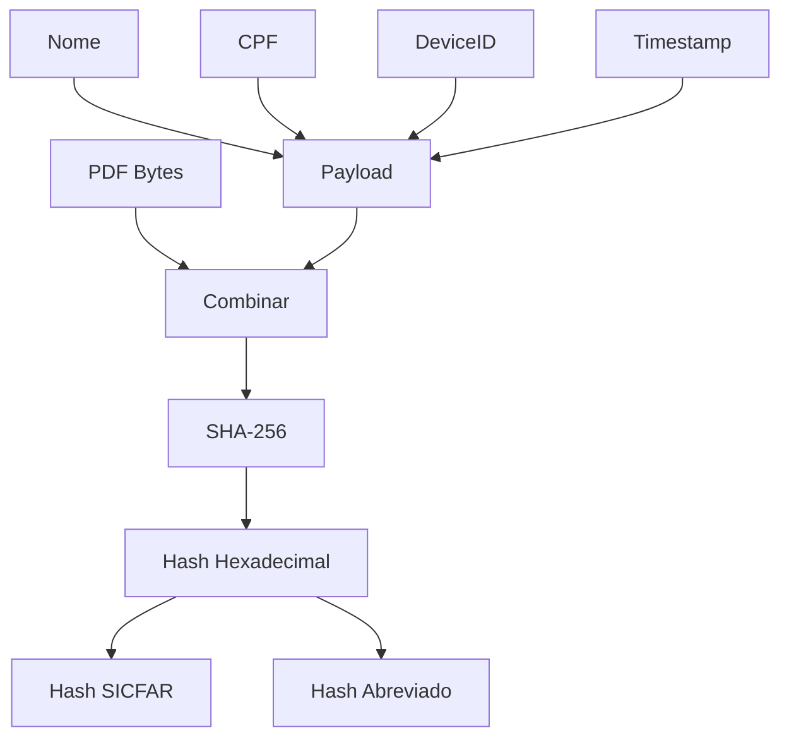

# Sistema de Hash - Documentação

Este documento explica como o sistema de hash criptográfico funciona no projeto de assinatura eletrônica.

---

## Visão Geral

O sistema utiliza **SHA-256** (Secure Hash Algorithm 256-bit) para gerar hashes criptográficos únicos que garantem:

1. **Integridade do documento**: Qualquer alteração no PDF gera um hash diferente
2. **Não-repúdio**: A assinatura está vinculada aos dados do assinante
3. **Unicidade**: Cada assinatura gera um hash único

---

## API Web Crypto

O projeto utiliza a **Web Crypto API** nativa do navegador, disponível via `crypto.subtle`:

```typescript
// Disponível em todos os navegadores modernos
const hashBuffer = await crypto.subtle.digest('SHA-256', data);
```

**Vantagens:**
- Nativo do navegador (sem dependências)
- Performático (implementação em C++)
- Seguro (padrão W3C)

---

## Funções Implementadas

### 1. `generateSHA256(data)`

Gera um hash SHA-256 a partir de string ou bytes.

```typescript
/**
 * Gera hash SHA-256 a partir de dados
 * @param data - String ou Uint8Array
 * @returns Hash em formato hexadecimal (64 caracteres)
 */
export async function generateSHA256(data: string | Uint8Array): Promise<string> {
  let buffer: ArrayBuffer;
  
  if (typeof data === 'string') {
    // Converte string para bytes usando UTF-8
    const encoder = new TextEncoder();
    buffer = encoder.encode(data).buffer as ArrayBuffer;
  } else {
    buffer = data.buffer as ArrayBuffer;
  }
  
  // Gera hash usando Web Crypto API
  const hashBuffer = await crypto.subtle.digest('SHA-256', buffer);
  
  // Converte buffer para array de bytes
  const hashArray = Array.from(new Uint8Array(hashBuffer));
  
  // Converte cada byte para hexadecimal (2 caracteres)
  const hashHex = hashArray.map(b => b.toString(16).padStart(2, '0')).join('');
  
  return hashHex;
}
```

**Exemplo de uso:**

```typescript
// Hash de string
const hash1 = await generateSHA256('Hello World');
// Resultado: a591a6d40bf420404a011733cfb7b190d62c65bf0bcda32b57b277d9ad9f146e

// Hash de bytes
const bytes = new Uint8Array([72, 101, 108, 108, 111]);
const hash2 = await generateSHA256(bytes);
```

---

### 2. `generateSignatureHash(pdfBytes, name, cpf, deviceId, timestamp)`

Gera o hash único de uma assinatura combinando os bytes do PDF com os dados do assinante.

```typescript
/**
 * Gera hash de assinatura baseado no PDF e dados do assinante
 * @param pdfBytes - Bytes do arquivo PDF
 * @param signerName - Nome normalizado do assinante
 * @param signerCPF - CPF apenas dígitos
 * @param deviceId - Identificador do dispositivo
 * @param timestamp - Timestamp ISO da assinatura
 * @returns Hash SHA-256 da assinatura
 */
export async function generateSignatureHash(
  pdfBytes: Uint8Array,
  signerName: string,
  signerCPF: string,
  deviceId: string,
  timestamp: string
): Promise<string> {
  // 1. Criar payload com dados do assinante
  const signerPayload = `|NAME:${signerName}|CPF:${signerCPF}|DEVICE:${deviceId}|TIME:${timestamp}|`;
  
  // 2. Converter payload para bytes
  const signerBytes = new TextEncoder().encode(signerPayload);
  
  // 3. Combinar bytes do PDF + payload
  const combinedBytes = new Uint8Array(pdfBytes.length + signerBytes.length);
  combinedBytes.set(pdfBytes, 0);           // PDF primeiro
  combinedBytes.set(signerBytes, pdfBytes.length);  // Payload depois
  
  // 4. Gerar hash do conteúdo combinado
  return generateSHA256(combinedBytes);
}
```

---

## Composição do Hash

O hash de assinatura é gerado a partir da concatenação de:

```
[BYTES DO PDF] + "|NAME:NOME|CPF:00000000000|DEVICE:uuid|TIME:2024-01-01T00:00:00.000Z|"
```

### Estrutura do Payload

| Campo | Formato | Exemplo |
|-------|---------|---------|
| NAME | String uppercase | `JOÃO DA SILVA` |
| CPF | 11 dígitos | `12345678901` |
| DEVICE | UUID v4 | `550e8400-e29b-41d4-a716-446655440000` |
| TIME | ISO 8601 | `2024-01-15T10:30:00.000Z` |

### Por que essa estrutura?

1. **PDF bytes primeiro**: Vincula a assinatura ao conteúdo exato do documento
2. **Delimitadores `|`**: Previnem colisões entre campos
3. **Prefixos `NAME:`, `CPF:`**: Identificam claramente cada dado
4. **Ordem fixa**: Garante reprodutibilidade do hash

---

## Formato do Hash SICFAR

Para facilitar visualização e verificação, o hash é formatado no estilo SICFAR:

```typescript
/**
 * Formata hash como SICFAR (XX-XX-XX-...)
 */
function formatHashTotvs(hash: string): string {
  return hash.toUpperCase().match(/.{1,2}/g)?.join('-') || hash;
}

/**
 * Gera hash SICFAR (primeiros 20 bytes)
 */
function generateTotvsHash(hash: string): string {
  const bytes = hash.substring(0, 40); // 20 bytes = 40 hex chars
  return formatHashTotvs(bytes);
}
```

**Exemplo:**

```typescript
const fullHash = 'a591a6d40bf420404a011733cfb7b190d62c65bf0bcda32b57b277d9ad9f146e';
const totvsHash = generateTotvsHash(fullHash);
// Resultado: A5-91-A6-D4-0B-F4-20-40-4A-01-17-33-CF-B7-B1-90-D6-2C-65-BF
```

---

## Abreviação de Hash

Para exibição em interfaces, o hash pode ser abreviado:

```typescript
/**
 * Abrevia hash para exibição
 * @param hash - Hash completo
 * @param length - Caracteres no início e fim (padrão: 8)
 * @returns Hash abreviado "abc12345...xyz98765"
 */
export function abbreviateHash(hash: string, length: number = 8): string {
  if (hash.length <= length * 2 + 3) return hash;
  return `${hash.substring(0, length)}...${hash.substring(hash.length - length)}`;
}
```

**Exemplo:**

```typescript
const hash = 'a591a6d40bf420404a011733cfb7b190d62c65bf0bcda32b57b277d9ad9f146e';
const short = abbreviateHash(hash, 8);
// Resultado: a591a6d4...ad9f146e
```

---

## Fluxo Completo de Hash



---

## Exemplo Prático

```typescript
import { generateSignatureHash, abbreviateHash } from '@/utils/hash';

// Dados de exemplo
const pdfBytes = new Uint8Array([/* bytes do PDF */]);
const name = 'JOÃO DA SILVA';
const cpf = '12345678901';
const deviceId = '550e8400-e29b-41d4-a716-446655440000';
const timestamp = '2024-01-15T10:30:00.000Z';

// Gerar hash
const hash = await generateSignatureHash(pdfBytes, name, cpf, deviceId, timestamp);
console.log('Hash completo:', hash);
// a591a6d40bf420404a011733cfb7b190d62c65bf0bcda32b57b277d9ad9f146e

console.log('Hash abreviado:', abbreviateHash(hash));
// a591a6d4...ad9f146e

// Para verificação: mesmo input = mesmo hash
const hash2 = await generateSignatureHash(pdfBytes, name, cpf, deviceId, timestamp);
console.log('Hashes iguais:', hash === hash2); // true
```

---

## Verificação de Integridade

Para verificar se um documento foi alterado:

```typescript
async function verifyDocumentIntegrity(
  originalPdfBytes: Uint8Array,
  signature: SignatureData
): Promise<boolean> {
  // Recalcular hash
  const calculatedHash = await generateSignatureHash(
    originalPdfBytes,
    signature.name,
    signature.cpf,
    signature.deviceId,
    signature.timestamp
  );
  
  // Comparar com hash armazenado
  return calculatedHash === signature.hash;
}
```

---

## Considerações de Segurança

### Pontos Fortes
- SHA-256 é resistente a colisões
- Web Crypto API é segura e padronizada
- Hash inclui todos os dados relevantes

### Limitações (MVP)
- Não usa certificado digital
- Device ID pode ser falsificado
- Timestamp é do cliente (pode ser manipulado)

### Para Produção
- Usar servidor para timestamp confiável
- Integrar com ICP-Brasil para certificados
- Obter IP real via backend
- Armazenar logs no servidor

---

## Código Completo (hash.ts)

```typescript
/**
 * Gera hash SHA-256
 */
export async function generateSHA256(data: string | Uint8Array): Promise<string> {
  let buffer: ArrayBuffer;
  
  if (typeof data === 'string') {
    const encoder = new TextEncoder();
    buffer = encoder.encode(data).buffer as ArrayBuffer;
  } else {
    buffer = data.buffer as ArrayBuffer;
  }
  
  const hashBuffer = await crypto.subtle.digest('SHA-256', buffer);
  const hashArray = Array.from(new Uint8Array(hashBuffer));
  const hashHex = hashArray.map(b => b.toString(16).padStart(2, '0')).join('');
  
  return hashHex;
}

/**
 * Gera hash de assinatura
 */
export async function generateSignatureHash(
  pdfBytes: Uint8Array,
  signerName: string,
  signerCPF: string,
  deviceId: string,
  timestamp: string
): Promise<string> {
  const signerPayload = `|NAME:${signerName}|CPF:${signerCPF}|DEVICE:${deviceId}|TIME:${timestamp}|`;
  const signerBytes = new TextEncoder().encode(signerPayload);
  
  const combinedBytes = new Uint8Array(pdfBytes.length + signerBytes.length);
  combinedBytes.set(pdfBytes, 0);
  combinedBytes.set(signerBytes, pdfBytes.length);
  
  return generateSHA256(combinedBytes);
}

/**
 * Abrevia hash para exibição
 */
export function abbreviateHash(hash: string, length: number = 8): string {
  if (hash.length <= length * 2 + 3) return hash;
  return `${hash.substring(0, length)}...${hash.substring(hash.length - length)}`;
}
```
