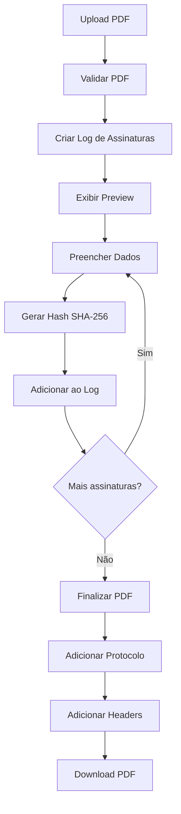

# Documentação do Projeto: Assinatura Eletrônica de PDF

## Índice

1. [Visão Geral](#visão-geral)
2. [Arquitetura do Projeto](#arquitetura-do-projeto)
3. [Tecnologias Utilizadas](#tecnologias-utilizadas)
4. [Fluxo de Assinatura](#fluxo-de-assinatura)
5. [Documentação Detalhada](#documentação-detalhada)

---

## Visão Geral

Este é um **MVP (Minimum Viable Product)** de uma aplicação **100% frontend** para assinatura eletrônica de documentos PDF. A aplicação permite:

- Upload de arquivos PDF
- Visualização do PDF no navegador
- Coleta de dados do assinante (Nome e CPF)
- Geração de hash criptográfico SHA-256 para cada assinatura
- Múltiplas assinaturas no mesmo documento
- Geração de PDF finalizado com página de protocolo
- Download do documento assinado

### Características Principais

| Recurso | Descrição |
|---------|-----------|
| **100% Frontend** | Não requer backend/servidor |
| **Device ID** | Identificador único do dispositivo (substitui IP em produção) |
| **Hash SHA-256** | Criptografia para integridade da assinatura |
| **Protocolo SICFAR** | Formato de hash estilo SICFAR (XX-XX-XX-...) |
| **LocalStorage** | Persistência do log de assinaturas |
| **Validação CPF** | Validação completa de CPF brasileiro |

---

## Arquitetura do Projeto

```
src/
├── App.tsx                 # Componente principal (orquestrador)
├── main.tsx               # Entry point
├── index.css              # Estilos globais (Tailwind)
│
├── components/            # Componentes React
│   ├── PDFUpload.tsx      # Upload de PDF (drag & drop)
│   ├── PDFPreview.tsx     # Visualização do PDF
│   ├── SignerForm.tsx     # Formulário de assinatura
│   ├── SignatureLog.tsx   # Log de assinaturas
│   ├── ActionBar.tsx      # Barra de ações
│   └── ui/                # Componentes UI (shadcn/ui)
│
├── services/              # Serviços de negócio
│   └── pdf.ts             # Manipulação de PDF (pdf-lib)
│
├── utils/                 # Utilitários
│   ├── cpf.ts             # Validação e formatação de CPF
│   ├── hash.ts            # Geração de hash SHA-256
│   ├── device.ts          # Gerenciamento de Device ID
│   └── storage.ts         # Persistência LocalStorage
│
├── schemas/               # Schemas de validação
│   └── signer.ts          # Schema Zod para assinante
│
└── types/                 # Tipos TypeScript
    └── index.ts           # Interfaces e tipos
```

---

## Tecnologias Utilizadas

### Core
- **React 19** - Framework UI
- **TypeScript** - Tipagem estática
- **Vite** - Build tool

### Manipulação de PDF
- **pdf-lib** - Criação e modificação de PDFs
- **pdfjs-dist** - Renderização de PDF para visualização
- **react-pdf** - Componente React para exibição

### Validação e Formulários
- **React Hook Form** - Gerenciamento de formulários
- **Zod** - Validação de schemas
- **@hookform/resolvers** - Integração RHF + Zod

### UI
- **Tailwind CSS 4** - Estilização
- **Radix UI** - Componentes primitivos
- **shadcn/ui** - Componentes estilizados
- **Lucide React** - Ícones

---

## Fluxo de Assinatura



---

## Documentação Detalhada

Para informações mais detalhadas, consulte os seguintes documentos:

- [Guia de Implementação](./IMPLEMENTATION_GUIDE.md) - Como implementar em outro projeto
- [Serviço de PDF](./PDF_SERVICE.md) - Documentação completa da manipulação de PDF
- [Sistema de Hash](./HASH_SYSTEM.md) - Como funciona a geração de hash
- [Tipos e Interfaces](./TYPES.md) - Documentação dos tipos TypeScript
- [Utilitários](./UTILITIES.md) - Funções auxiliares disponíveis
- [Componentes](./COMPONENTS.md) - Documentação dos componentes React

---

## Licença

Este projeto é um MVP para fins de demonstração.
